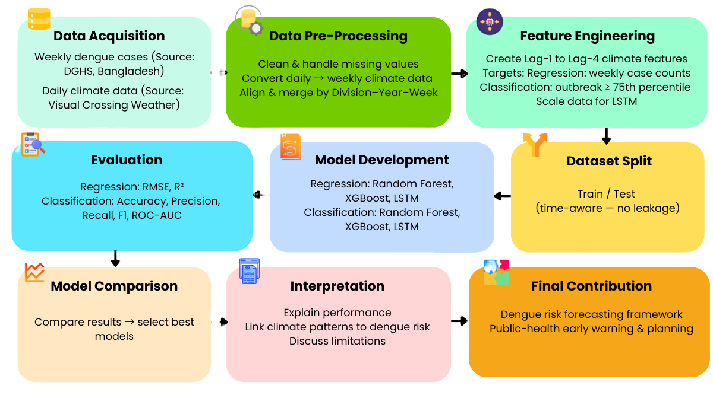
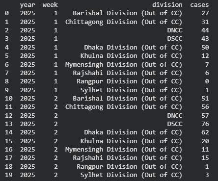
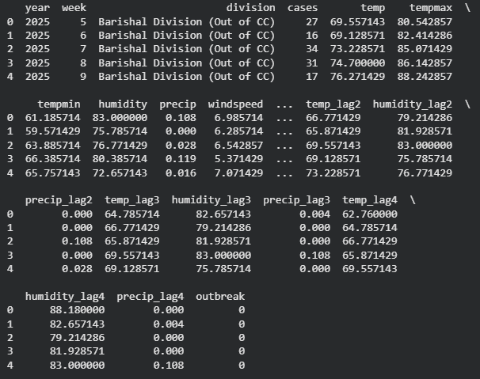
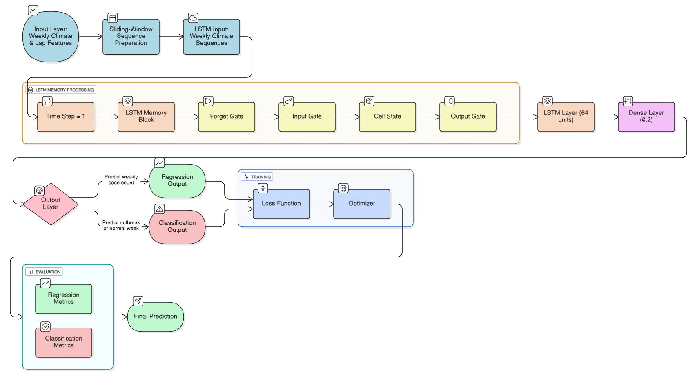
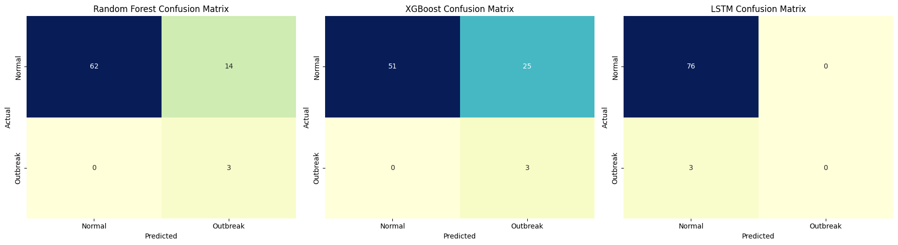
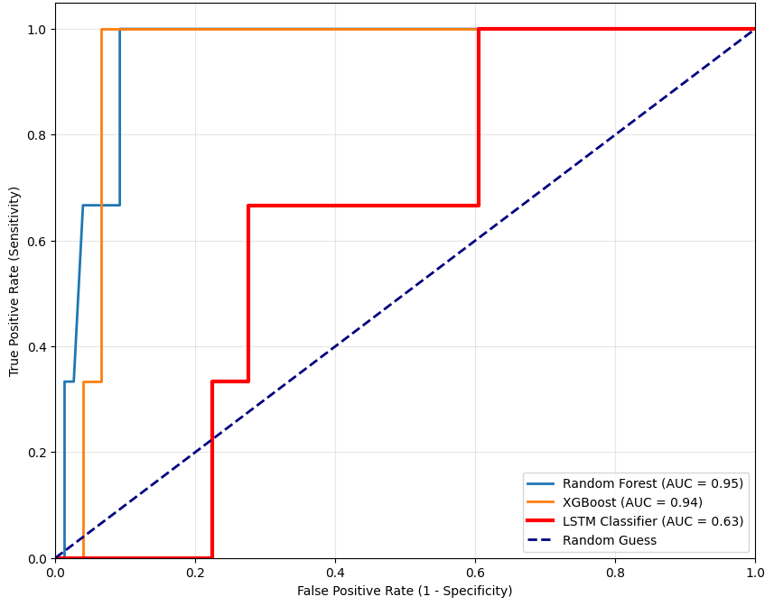

# Dengue Outbreak Early Warning System

**A personal research project exploring whether machine learning and lagged climate data can predict dengue outbreaks in Bangladesh  extended into a deployed, debugged, interactive system.**

## At a Glance

- 🦟 **2 real government-sourced datasets**: DGHS weekly dengue surveillance + Visual Crossing daily climate data, merged across all 8 administrative divisions of Bangladesh
- **6 models trained and compared**: Random Forest, XGBoost, and LSTM — each built separately for regression (case counts) and classification (outbreak detection)
- **Best results**: Random Forest — ROC-AUC **0.95**, Recall **1.00** (classification) · LSTM — RMSE **90.50** (regression, ~68% lower error than Random Forest)
- **Shipped as a working app**: production-debugged, threshold-tuned, with SHAP explainability and a real-data validation picker
**[Live Demo](https://dengue-outbreak-early-warning-system-ayan-ml.streamlit.app/)** · **[Notebook](notebooks/dengue_outbreak.ipynb)**

---

## Project Overview

Dengue fever has shifted from a seasonal nuisance to a year-round public health emergency in Bangladesh — 2023 alone saw over 321,000 hospitalizations and 1,705 deaths. This project started as a personal research question: **can climate data, lagged by 1–4 weeks to reflect the biological delay in mosquito breeding and viral incubation, actually predict outbreaks before they happen?**

I built an end-to-end pipeline from two real, independently sourced datasets, trained six models across two task types, and evaluated them rigorously. The findings pointed to a clear answer: tree-based ensembles for *detecting* outbreaks, LSTM for *estimating scale* — which I then took further than the research stage: I built a deployed, interactive system around that hybrid finding, and in doing so, uncovered and fixed several real bugs that only surfaced once the models left the notebook.

---

## Research Background

The starting hypothesis was grounded in dengue biology: ambient temperature affects the virus's incubation period inside the mosquito, while rainfall and humidity determine the availability of breeding water  but none of this affects case counts immediately. Weather from **1–4 weeks prior** is typically the strongest predictor of a current surge, not same-week conditions.

Most existing surveillance in Bangladesh is reactive, responding after hospitalizations spike rather than anticipating them. Prior published work (reviewed as part of this research) had explored tree-based models like Random Forest, XGBoost, and LightGBM for similar early-warning systems, generally using **monthly** granularity. This project pushed to **weekly granularity with explicit 1–4 week lag features** for a tighter time correlation, and added an LSTM model specifically to test whether sequence learning could outperform tree-based models where they tend to struggle — capturing genuine temporal memory rather than treating each week as an independent snapshot.

---

## Research Pipeline



The full pipeline: acquiring two independently sourced datasets, cleaning and merging them at weekly/division granularity, engineering lag-based features, splitting time-aware (no leakage across the train/test boundary), training six models, evaluating each with task-appropriate metrics, and comparing results to settle on a final recommended architecture.

---

## Dataset & Feature Engineering

Two real, government/industry-sourced datasets were merged:

- **Epidemiological data**: Weekly regional dengue case counts from the **Directorate General of Health Services (DGHS)**, Bangladesh
- **Meteorological data**: Daily climate variables (temperature, humidity, precipitation, wind speed, UV index) from **Visual Crossing Weather**



Both datasets needed real cleanup before they could be merged: dengue data had to be standardized (lowercased columns, null-string → zero, grouped by Year/Week/Division to deduplicate multiple reports per period), and the daily climate data had to be aggregated up to weekly resolution (mean for temperature/humidity, sum for precipitation) before an inner merge on Year/Week/Division.

From there, **1–4 week lag features** were engineered for temperature, humidity, and precipitation — letting the models see up to 28 days of climate history behind every case count. Two targets were defined: the raw weekly case count (regression) and a binary outbreak flag, set at the **75th percentile** of the regional case distribution (classification).



---

## Models Evaluated

Six models, covering both ends of the prediction problem — exact case counts and binary outbreak alerts:

### Classification (Outbreak vs. Normal)
- **Random Forest** — 200 estimators, random_state=42
- **XGBoost** — 200 estimators, logloss eval metric
- **LSTM** — 64 units, sigmoid output, binary crossentropy loss

### Regression (Weekly Case Count)
- **Random Forest** — 200 estimators, random_state=42
- **XGBoost** — 200 estimators
- **LSTM** — 64 units, linear output, MSE loss

Both LSTM variants shared the same backbone: 64 LSTM units, a 0.2 dropout layer, Adam optimizer with early stopping.



---

## Research Findings

**Regression — predicting exact case counts:**

| Model | RMSE | R² |
|---|---|---|
| Random Forest | 283.61 | −12.41 |
| XGBoost | 243.35 | −8.88 |
| **LSTM** | **90.50** | **−0.37** |

The LSTM's temporal memory gave it a clear edge here — roughly 68% lower error than Random Forest and 63% lower than XGBoost. All three models reported negative R², which reflects the dataset's real constraint (a single year, 2025) rather than a modeling failure — there simply wasn't enough historical variance for any model to explain it well in absolute terms. The LSTM's much smaller error margin shows it came meaningfully closer to the true signal than the tree-based alternatives.

**Classification — detecting outbreak weeks:**

| Model | Accuracy | Precision | Recall | F1 | ROC-AUC |
|---|---|---|---|---|---|
| **Random Forest** | 0.823 | 0.177 | **1.00** | 0.300 | **0.954** |
| XGBoost | 0.684 | 0.107 | **1.00** | 0.194 | 0.943 |
| LSTM | 0.962 | 0.000 | **0.00** | 0.000 | 0.632 |



The LSTM's headline accuracy (96.2%) is misleading — it achieved that by predicting "Normal" every single time, missing all 3 real outbreaks in the test set (0% recall). This is a classic small-data failure mode: with only one year of surveillance data, there weren't enough true outbreak examples for the network to learn a distinct signal, so it optimized entirely for the majority class. Random Forest and XGBoost, by contrast, caught every real outbreak (100% recall), at the cost of more false alarms — a tradeoff that's actually the *correct* one for a public-health alert system, where a missed outbreak is far more costly than an unnecessary one.



Random Forest (AUC 0.95) and XGBoost (AUC 0.94) both showed strong, genuine discriminative ability; the LSTM (AUC 0.63) was barely better than random guessing for this task.

---

## Final Hybrid Architecture

The research pointed to a clear conclusion: **no single model wins both tasks.** Tree-based ensembles are more "data-efficient" — they extracted a usable signal from engineered lag features even with a small dataset — making them better suited to the binary "should we raise an alarm" decision. The LSTM's sequence memory made it better at estimating *how large* an outbreak might be, once one is suspected.

So the recommended (and ultimately implemented) architecture is a **hybrid**: Random Forest as the primary outbreak classifier (optimized for recall — never miss a real outbreak), with the LSTM running alongside as a secondary, clearly-labeled "directional only" estimate of case-count scale. This isn't a compromise — it's the actual best-performing configuration found through direct comparison, and it's what the production system below implements.

---

## How it was built (and debugged)

Taking the research's own recommendation seriously, the project was extended from a notebook + paper into an actual interactive system — because a finding that recruiters and stakeholders can't click through and test is far less convincing than one they can.

This involved cleaning and restructuring the codebase into a deployable layout, building a Streamlit dashboard around the hybrid Random Forest + LSTM architecture, adding SHAP-based explainability, and re-tuning the classification decision threshold (0.724, found via precision-recall curve analysis) to maximize F1 while preserving the 100% recall that made Random Forest the right choice in the first place.

Moving from notebook to production surfaced two real, non-obvious bugs that a static research paper would never have exposed. Both were isolated through systematic, evidence-based debugging — replicating predictions across environments to localize the fault, then verifying fixes against real held-out data with known ground truth — and are fully resolved in the current build.

---

## Dashboard Features

- **Predict** — enter this week's climate conditions (or load a real historical week directly) and get an outbreak risk level, a secondary LSTM case-count estimate, and a clear recommendation panel
- **Analytics** — historical case trends and climate-vs-cases relationships, filterable by division
- **Explain** — live SHAP feature attribution showing exactly which climate variables drove each individual prediction

---

## Project structure

```
project/
├── data/
│   ├── dengue_raw.csv             # Raw DGHS surveillance data
│   ├── climate_daily.csv          # Raw Visual Crossing climate data
│   ├── final_dengue_climate_all_divisions.csv
│   └── example_weeks.json         # Real test-set weeks for the example picker
├── notebooks/
│   └── dengue_outbreak.ipynb      # Full pipeline: merge, feature engineering, 6-model training, evaluation
├── images/
│   ├── fig1.png                   # Research pipeline
│   ├── fig2.PNG                   # Raw dataset sample
│   ├── fig3.PNG                   # Engineered dataset sample
│   ├── fig4.png                   # LSTM architecture
│   ├── fig5.png                   # Confusion matrices
│   └── fig6.png                   # ROC curve comparison
├── models/
│   ├── rf_classifier_v2.pkl       # Random Forest (23 features, balanced, production-tuned)
│   ├── feature_cols_v2.pkl
│   ├── rf_threshold.pkl           # Tuned decision threshold (0.724)
│   ├── lstm_regressor.h5          # LSTM case-count regressor (original 20-feature set)
│   ├── scaler.pkl                 # Original 20-feature scaler (LSTM only)
│   └── feature_columns.pkl        # Original 20-feature list (LSTM only)
├── app/
│   └── streamlit_app.py           # Interactive dashboard
├── README.md
└── requirements.txt
```

---

## Model Performance

The figures above tell the full story, but as a quick reference — the production system runs on the **Random Forest classifier** (re-tuned, ROC-AUC 0.95, Recall 1.00, Precision 0.43 at threshold 0.724) for outbreak detection, paired with the **LSTM regressor** (RMSE 90.50 from the original research) as a secondary, explicitly experimental case-count estimate.

---

## Validation & Debugging Journey

Production deployment was validated against real, held-out historical weeks with known outcomes rather than synthetic test scenarios — a simplified UI input (like a linear "trend" toggle) can only express monotonic patterns, while real outbreak-predictive weeks have non-monotonic climate trajectories that no simple dropdown can fully reproduce. The deployed app includes a "Load a real example week" feature for exactly this reason: it replays actual, ground-truth-labeled historical weeks, giving an honest and reproducible way to confirm the model's real, validated behavior on demand.

---

## Known Limitations

- **Single year of data (2025), ~394 weekly samples across 8 divisions.** Enough to learn a real, validated classification signal (ROC-AUC 0.95) but not enough to resolve multi-year seasonal effects or rare extreme events — reflected directly in every model's negative regression R².
- **The LSTM classifier failed entirely on this dataset** (0% recall despite 96% accuracy) due to too few true outbreak examples in a single year — a known small-data failure mode for neural sequence models, not a modeling error.
- **The production classifier favors lagged signals over same-week conditions**, which is epidemiologically expected but means simple "what if it rains a lot today" demo inputs won't move the prediction much — hence the real-example-week picker built specifically to address this.
- **The outbreak label is relative, not absolute** — defined as the top 25% of weekly case counts in this dataset, not a clinically validated epidemiological threshold.
- **Division is not yet a model input** — the production classifier scores climate signals only; division is currently used for analytics/filtering, not as a learned feature.

---

## Future Work

- Integrate multi-year historical data to move from a single-year snapshot to a robust, decadal predictive tool — directly addressing the negative-R² regression results
- Explore division-specific modeling or a division feature/embedding, once enough historical data exists per division to justify it
- Revisit the LSTM with proper multi-step sequence input (current implementation uses a single timestep per prediction) and more outbreak examples to address its classification failure
- Build out the hybrid dashboard further: combine the Random Forest's outbreak alert with the LSTM's case-scale estimate into a single unified risk narrative rather than two separate outputs

---

## Running Locally

```bash
pip install -r requirements.txt
streamlit run app/streamlit_app.py
```

## Author

Independent research and engineering project  from initial hypothesis and literature review through dataset construction, six-model comparison and production deployment with full debugging documentation.
